  

<h1 align="center">Klaros</h1>

  <strong>Security that attacks, proves, and protects.</strong>

  Autonomous offensive security + runtime protection for the AI era.

  
  
  

  <a href="https://getklaros.com"><strong>Website</strong></a>
  ·
  <a href="mailto:hello@getklaros.com?subject=Klaros%20early%20access"><strong>Early access</strong></a>
  ·
  <a href="mailto:hello@getklaros.com">Contact</a>

---

## 🔐 Two products. One security philosophy.

  <strong>Prove what can be exploited. Control what crosses your AI boundary.</strong>

<table>
<tr>
<td width="50%" align="center" valign="top">
 
<h3>⚔️ Klaros Engine</h3>

<strong>Prove what is actually exploitable.</strong>

AUTONOMOUS OFFENSIVE SECURITY

Web & APIs · Source code · Pull requests · Web3 / EVM

<code>MAP → ATTACK → PROVE → REPLAY</code>

Multi-agent pentesting that executes real tests, preserves evidence and independently validates material findings before reporting them.

<strong>Proof, not another alert feed.</strong>

<a href="https://github.com/GetKlaros/klaros-engine"><strong>Explore Klaros Engine →</strong></a>

 
</td>
<td width="50%" align="center" valign="top">
 
<h3>🛡️ Klaros Firewall</h3>

<strong>Control what reaches your models.</strong>

LOCAL-FIRST AI RUNTIME SECURITY

Prompt attacks · PII · Secrets · Policy enforcement

<code>INSPECT → DETECT → DECIDE → ENFORCE</code>

A provider-neutral AI security layer that inspects content locally and applies policy before sensitive or unsafe interactions continue.

<strong>Keep the AI boundary under your control.</strong>

<a href="https://github.com/GetKlaros/klaros-firewall"><strong>Explore Klaros Firewall →</strong></a>

 
</td>
</tr>
</table>

---

## 🧠 Why Klaros

**✅ Proof over alerts**  
A finding should survive validation and replay, not just match a rule.

**🔒 Local-first where it matters**  
Security-sensitive content can stay inside your environment.

**🔌 Provider-neutral**  
Klaros is designed around your security boundary, not a single model or cloud provider.

**🤖 Built for automation**  
CLI, API, CI/CD, hosted campaigns and machine-readable evidence are first-class workflows.

---

## 🔄 From code to runtime

```mermaid
flowchart LR
  subgraph PRE["⚔️ BEFORE DEPLOYMENT"]
    direction TB
    E0["Klaros Engine"]
    E1["Map attack surface"]
    E2["Attack"]
    E3["Prove exploitability"]
    E4["Replay independently"]
    E0 --> E1 --> E2 --> E3 --> E4
  end

  subgraph RUN["🛡️ DURING AI RUNTIME"]
    direction TB
    F0["Klaros Firewall"]
    F1["Inspect AI traffic"]
    F2["Detect risky content"]
    F3["Decide policy"]
    F4["Enforce"]
    F0 --> F1 --> F2 --> F3 --> F4
  end

  E4 -. "release" .-> F0

  classDef engine fill:#f5f3ff,stroke:#7c3aed,color:#111827;
  classDef firewall fill:#ecfeff,stroke:#0891b2,color:#111827;
  class E0,E1,E2,E3,E4 engine;
  class F0,F1,F2,F3,F4 firewall;
```

  <strong>Before deployment:</strong> find and prove exploitable weaknesses. 
  <strong>During AI runtime:</strong> inspect traffic and enforce policy in real time.

Klaros is being built around a simple idea: **security controls should either prevent a real failure or prove that a real failure exists.**

---

## 🚧 Current product stage

- **Klaros Engine** — Alpha; real Web/API/code/CI/Web3 offensive workflows are running today.
- **Klaros Firewall Community** — Pre-alpha; local API, policy engine, built-in detectors, proxy and operator UI are available in development.
- **Klaros SaaS** — Early hosted control plane with campaigns, immutable snapshots, live events, findings and reports.

We are actively working with early users while the public product surface is being finalized.

---

## 📬 Early access

If you are building AI systems, running application security programs, or want autonomous pentesting with reproducible evidence:

  <a href="mailto:hello@getklaros.com?subject=Klaros%20early%20access"><strong>→ Request early access</strong></a>
  &nbsp;&nbsp;·&nbsp;&nbsp;
  <a href="https://getklaros.com"><strong>getklaros.com</strong></a>

  Authorized security testing only. Klaros offensive products are intended for systems you own or are explicitly permitted to test.

